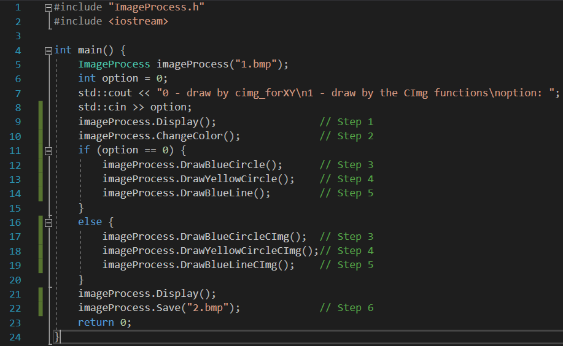
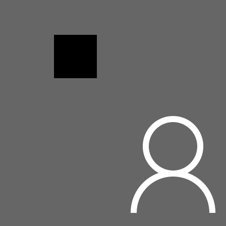
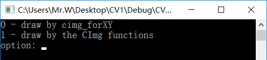
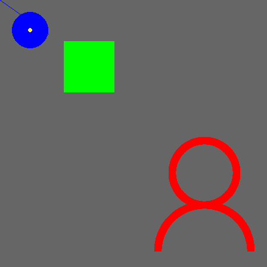
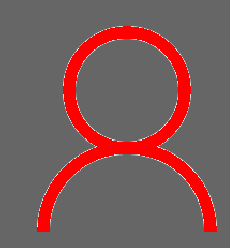
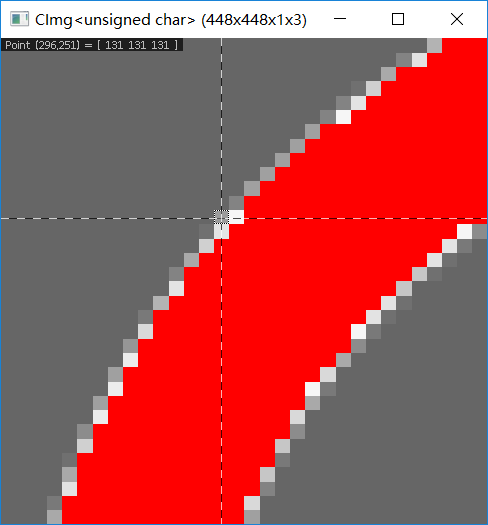

# CVEx1

## 一、测试环境

Visual Studio 2017

（若在命令行里用g++编译须添加-O2 -lgdi32命令，编译方法为`g++ main.cpp
ImageProcess.cpp -O2 -lgdi32）`

## 二、实验步骤

**1、测试数据**

**（1）测试函数main.cpp**

测试函数main.cpp如下所示，Step对应的是题目的题号：

**（2）测试数据1.bmp**

要处理的原图为1.bmp，如下图所示：

**（3）编译运行**

提示输入0或1。若输入0，则用cimg_forXY画图；否则用CImg自带的函数画图。

**2、测试结果**

**（1）三、四、五步使用cimg_forXY画图的结果**

**（2）三、四、五步使用CImg画图的结果**

## 三、实验结果分析

**1、第四步绘制的圆形区域效果分析**

如图，对比两种方法画图的效果图：

图（a）：使用cimg_forXY画图 图（b）：使用CImg自带的函数画图

（a）

（b）

使用cimg_forXY画圆的方法是通过遍历图片每个像素，并计算像素到圆心的距离来画的。当画蓝色的大圆（半径为30）时，图（a）和图（b）效果相差无几。但当画黄色的小圆（半径为3）时，图（a）和图（b）的效果相差较大。

实验分析：由于半径过小，并且像素点数量有限，并且计算过程中要进行取整，故出现误差，因此导致实验的第四步（画黄色小圆）的效果不好。

**2、第二步将白色区域变红色的分析**

实验第二部的要求是将白色区域变成红色，在遍历图片像素时，若判断对应要处理的像素的条件为

srcImg(x, y, 0) == 255 && srcImg(x, y, 1) == 255 && srcImg(x, y, 2) == 255

则会出现以下效果，出现一些白边

将图片放大，可知在边界上某些点并不是白色（RGB=255, 255, 255）

因此要将该判断语句的条件改为

srcImg(x, y, 0) != 0 && srcImg(x, y, 0) != 102 && srcImg(x, y, 1) != 102 &&
srcImg(x, y, 2) != 102

此时效果如下图所示：

