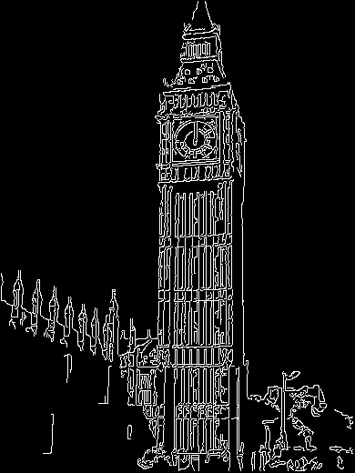

# CVEx2

## 一、测试环境 

Visual Studio 2017

若在命令行里用g++编译须添加-O2 -lgdi32，编译命令为：

`g++ main.cpp Canny.cpp -o Ex2.exe -std=c++11 -O2 -lgdi32`

## 二、实验测试

**注：改写的代码为code0。**为了显示清晰直观，**把边界和非边界的值反转了**，即边界是白色，非边界是黑色（原本的code0与此相反）

**1、测试数据**

**（1）测试函数**

测试函数为main.cpp，对下面的测试数据进行测试

**（2）测试数据**

测试图片有4张，位于test_Data目录下，分别为lena.bmp, stpietro.bmp, bigben.bmp,
twows.bmp：

测试参数共有3个，分别为sigma, tlow, thigh它们的描述如下所示：

\* sigma = The standard deviation of the gaussian smoothing filter.

\* tlow = Specifies the low value to use in hysteresis. This is a

\* fraction (0-1) of the computed high threshold edge strength value.

\* thigh = Specifies the high value to use in hysteresis. This fraction (0-1)

\* specifies the percentage point in a histogram of the gradient of

\* the magnitude. Magnitude values of zero are not counted in the

\* histogram.

**默认参数：**sigma = 0.8, tlow = 0.3, thigh = 0.7，其中lena的sigma默认是1.5

对算法的若干组参数，所有测试图像进行并分析各结果影响。分别对三个参数进行测试，测试其中一个参数时，其他参数设为默认参数。

**测试参数：**sigma = 0.5, sigma = 2; tlow = 0.2, tlow = 0.4; thigh = 0.6, thigh
= 0.8

**注：**默认参数生成的图像保存在out_Data目录下，对sigma, tlow,
thigh测试生成的图像分别保存在out_Data/sigma，out_Data/tlow，out_Data/thigh目录下。

**（3）编译运行**

如图所示，当输出“Complete!”后，所有图像生成完毕。

**2、测试结果**

**（1）默认参数生成的图像**

**（2）修改sigma参数生成的图像**

**lena.bmp** sigma的值分别为0.5，1.5，2

**stpietro.bmp** sigma的值分别为0.5，0.8，2

**bigben.bmp** sigma的值分别为0.5，0.8，2

**twows.bmp** sigma的值分别为0.5，0.8，2

**（3）修改tlow参数生成的图像**

**lena.bmp** tlow的值分别为0.2，0.3，0.4

**stpietro.bmp** tlow的值分别为0.2，0.3，0.4

**bigben.bmp** tlow的值分别为0.2，0.3，0.4

**twows.bmp** tlow的值分别为0.2，0.3，0.4

**（4）修改thigh参数生成的图像**

**lena.bmp** thigh的值分别为0.6，0.7，0.8

**stpietro.bmp** thigh的值分别为0.6，0.7，0.8

**bigben.bmp** thigh的值分别为0.6，0.7，0.8

**twows.bmp** thigh的值分别为0.6，0.7，0.8

## 三、实验结果分析

**1、总结Canny边缘检测器算法的步骤**

①对图像进行高斯模糊，降低噪声

②计算图像的梯度强度和方向

③应用非最大值抑制（Non-maximum suppression），把多像素宽的边缘变细，变成单像素宽

④应用滞后阈值法（Hysteresis
thresholding）来连接边缘点，用一个高阈值来开始连接边缘曲线，用一个低阈值来将他们继续连接起来。

（1）若某一像素位置的幅值超过高阈值，该像素被保留为边缘像素。

（2）若某一像素位置的幅值小于低阈值，该像素被排除。

（3）若某一像素位置的幅值在两个阈值之间，该像素仅仅在连接到一个高于高阈值的像素时被保留。

⑤首先把相邻的边缘连成长的线条，并删除长度小于20 的Edge。

**2、sigma对结果的影响**

**结果描述：**从上述实验结果图可看出，当sigma较小时，图像出现较多的噪声，但能够保留更多的细节（高频部分）。随着sigma增大，噪声得到了很好的抑制，但sigma过大时，图像原本一些正常的边界部分也被误认为是噪声了，造成了这些边界的缺失。

**分析：**sigma是高斯模糊（平滑）滤波的标准差。因为图像一般都有不少的噪声，噪声点与它邻近的像素的亮度值相差很大，若不加以去除，后面步骤对图像做梯度时，这些噪声点将被认为是图像的边界。有效的解决办法是先将图像进行高斯模糊（平滑），去掉大部分的噪声。Canny算法的第一步就是对图像进行高斯模糊，高斯模糊首先用sigma作为参数，生成卷积核（kernel），然后与原图做卷积。sigma的值越高，卷积核大小越大，对图像的模糊程度越高，若图像模糊程度过大，则会损失部分正常边界。

**结论**：修改sigma对结果的影响与实验预期相符。对于细节较多的图像，应选择较小的sigma，否则应选择较大的sigma。若图像的噪声很多，也应选择较大的sigma。

**3、tlow对结果的影响**

**结果描述：**从上述实验结果图可看出，当tlow比较小时，图像的弱边缘（梯度强度较小）显示较多；当tlow较大时，图像的弱边缘显示较少。

**分析：**滞后阈值法（Hysteresis
thresholding）中，若某一像素位置的幅值小于低阈值，该像素被排除。若某一像素位置的幅值在两个阈值之间，该像素仅仅在连接到一个高于高阈值的像素时被保留。

thigh是梯度强度直方图中的百分点，取值范围是(0,
1)，是滞后阈值法中使用的高阈值。而tlow是thigh的百分数，取值范围也是(0,
1)，是滞后阈值法中使用的低阈值。

**结论**：修改tlow对结果的影响与实验预期相符。当tlow比较小时，图像的弱边缘显示较多，这是因为较小的tlow允许更弱边缘作为边缘；当tlow较大时，图像的弱边缘显示较少，这是因为较大的tlow不允许太弱的边缘作为边缘，若tlow过大，将会丢失过多的应被保留的弱边缘。

**4、thigh对结果的影响**

**结果描述：**从上述实验结果图可看出，当thigh比较小时，图像的强边缘（梯度强度较大）显示较多；当thigh较大时，图像的强边缘显示较少。

**分析：**滞后阈值法（Hysteresis
thresholding）中，若某一像素位置的幅值超过高阈值，该像素被保留为边缘像素。若某一像素位置的幅值小于低阈值，该像素被排除。若某一像素位置的幅值在两个阈值之间，该像素仅仅在连接到一个高于高阈值的像素时被保留。thigh是梯度强度直方图中的百分点，取值范围是(0,
1)，是滞后阈值法中使用的高阈值。

**结论**：修改thigh对结果的影响与实验预期相符。当thigh比较小时，图像的强边缘（梯度强度较大）显示较多，因为较低的thigh将使更多边缘作为强边缘；当thigh较大时，图像的强边缘显示较少，因为较高的thigh将使更少边缘作为强边缘，即达到足够大的梯度强度才会视作强边缘。
