# CVEx3

## 一、测试环境 

Visual Studio 2017

若在命令行里用g++编译须添加-O2 -lgdi32，编译命令为：

`g++ main.cpp Canny.cpp HoughTransform.cpp HoughCircle.cpp -o Ex3.exe -std=c++11
-O2 -lgdi32`

**代码文件描述：**

HoughTransform.h和HoughTransform.cpp ：A4纸直线检测

HoughCircle.h和HoughCircle.cpp ：硬币圆检测

**注：编译运行前，应满足以下条件**

1.  在当前目录下必须存在Dataset1、Dataset2、Dataset1_out、Dataset2_out四个文件夹。（Dataset1_out和Dataset2_out分别为A4纸和硬币的输出目录。）

2.  要先将jpg图片转成bmp（在画图里可以转）。其中Dataset1文件夹里应包含6张A4纸bmp图片，分别为1.bmp, 2.bmp, 3.bmp, 4.bmp, 5.bmp, 6.bmp；Dataset2文件夹里应包含6张硬币bmp图片，分别为1.bmp, 2.bmp, 3.bmp, 4.bmp, 5.bmp, 6.bmp。

## 二、实验测试

**1、测试数据**

**（1）测试函数**

测试函数为main.cpp，对下面的测试数据进行测试

**（2）测试数据**

①A4纸图片：在Dataset1目录下，共6张，分别为1.bmp, 2.bmp, 3.bmp, 4.bmp, 5.bmp, 6.bmp;

②硬币图片：在Dataset2目录下，共6张，分别为1.bmp, 2.bmp, 3.bmp, 4.bmp, 5.bmp, 6.bmp。

**（3）编译运行**

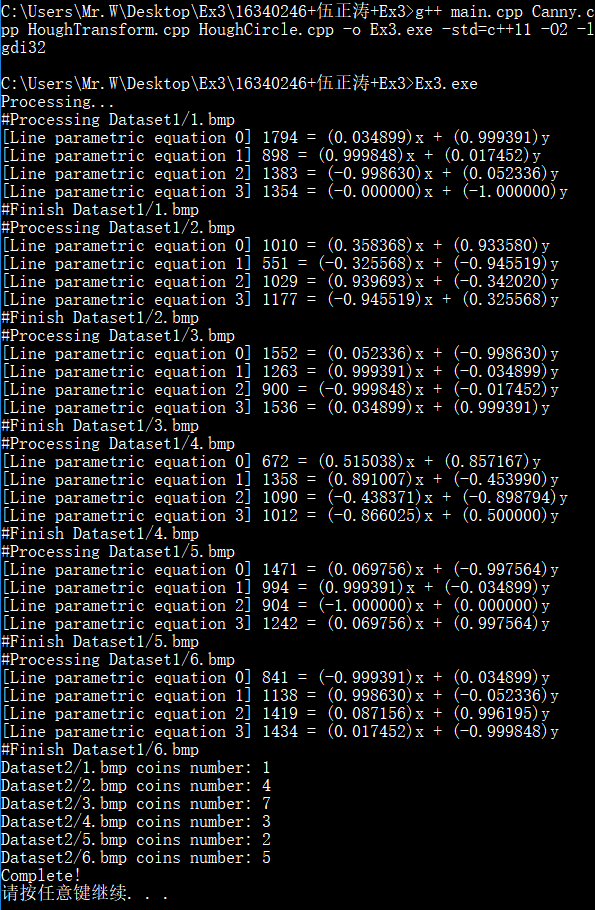

如图所示，当输出“Complete!”后，所有图像生成完毕。

**2、测试结果**

**（1）A4纸识别**

求得各直线参数方程（其所在的坐标系见[三、实验结果分析](## 三、实验结果分析)）如下：

1.bmp\~6.bmp的输出图像分别如下（为显示直观，角点半径设为20）：

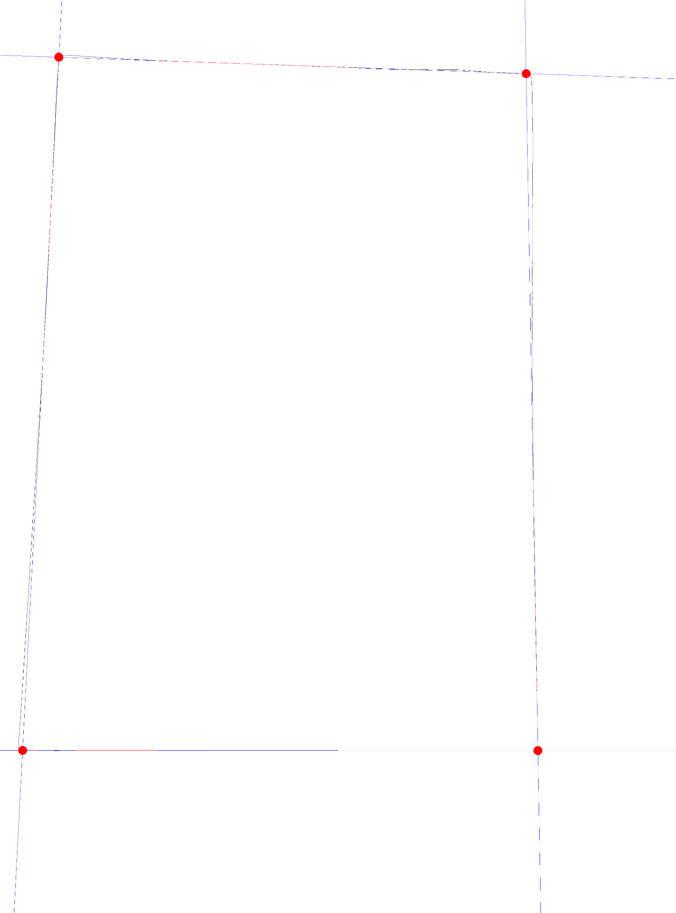

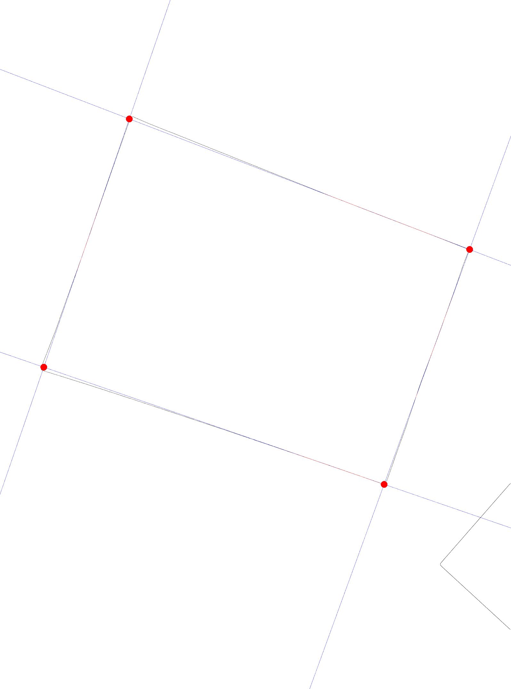

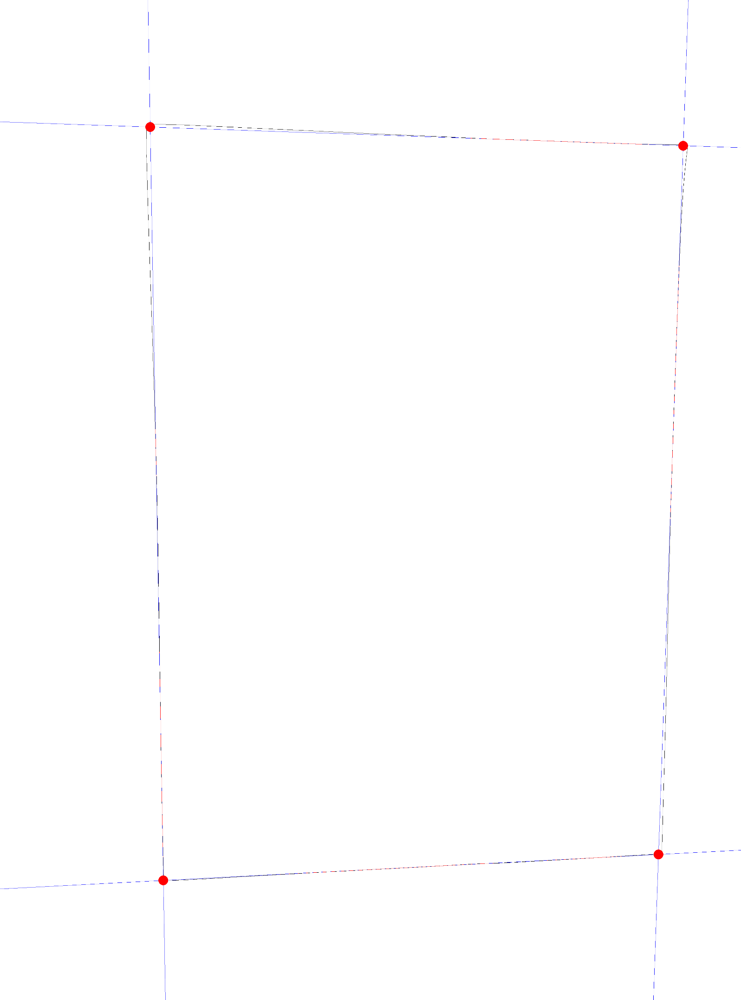

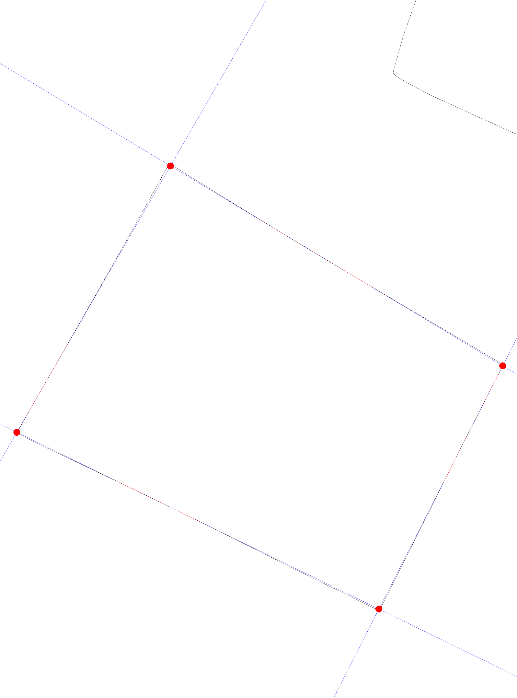

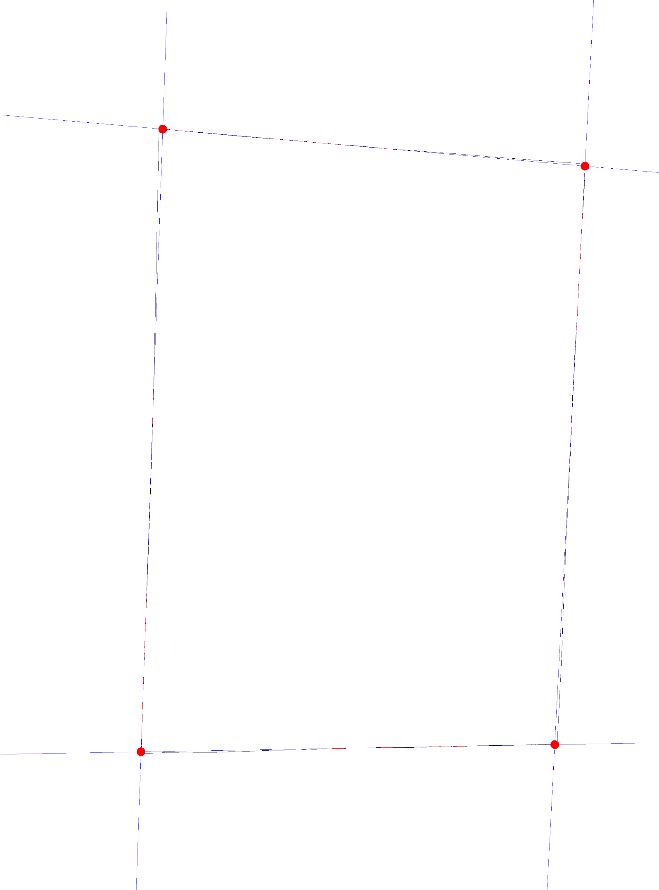

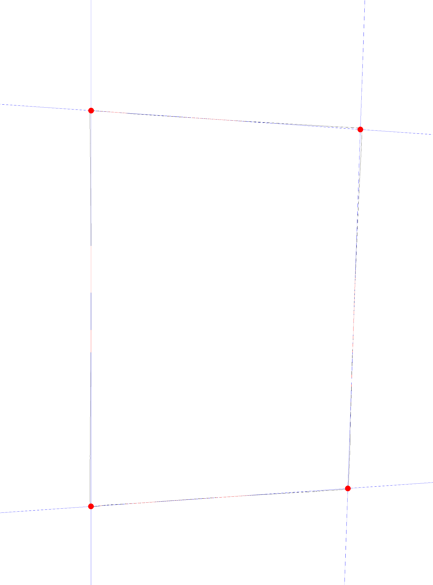

**（2）硬币识别**

1.bmp\~6.bmp检测到的硬币数量输出如下：

1.bmp\~6.bmp的输出图像分别如下（圆心用绿色点显示，拟合成的圆用蓝色表示，与圆周相关的像素用红色表示，**看不清时请放大看**）：

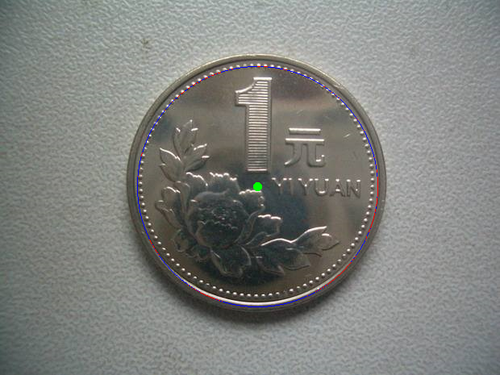

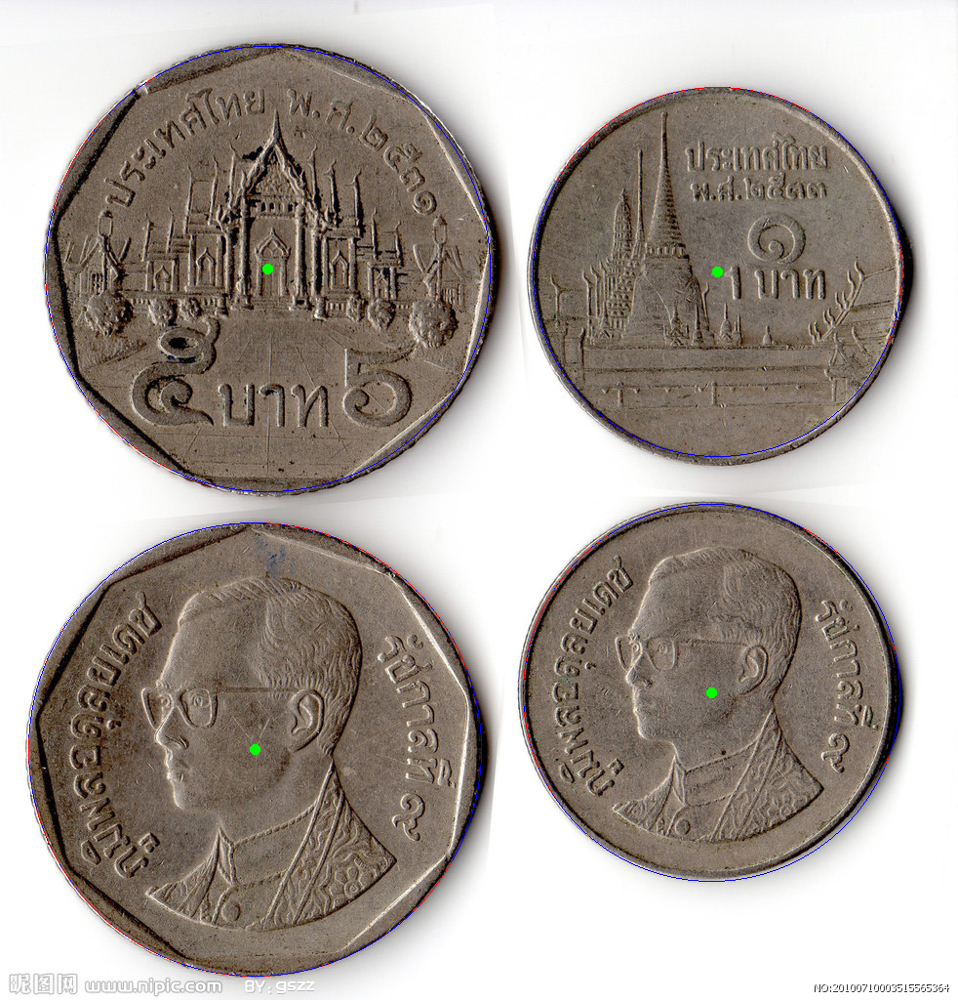

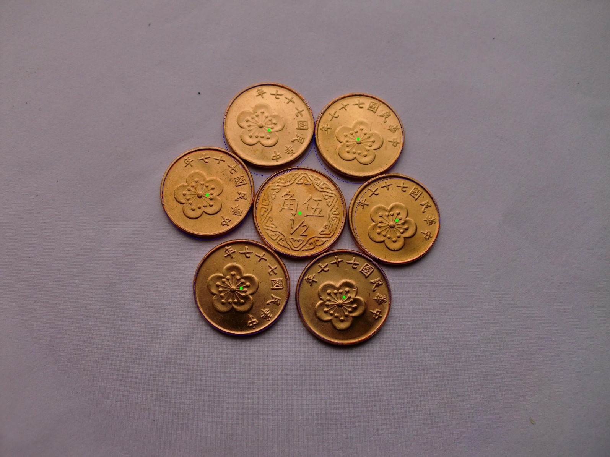

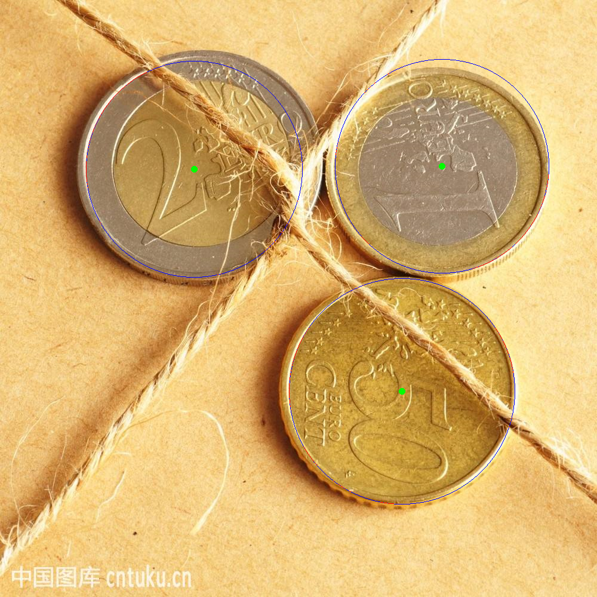

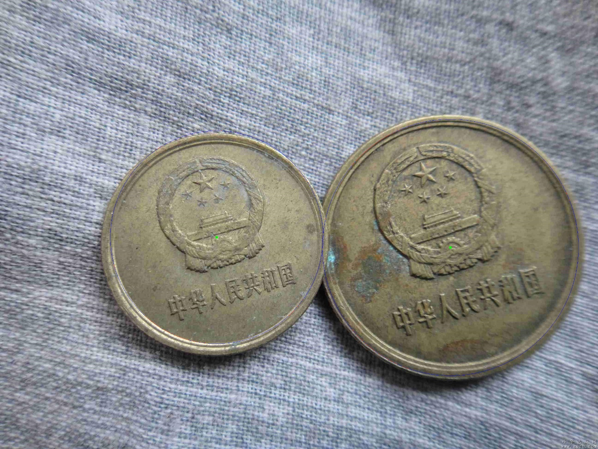

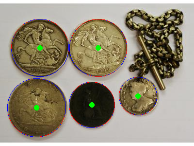

## 三、实验结果分析

**1、总结A4纸直线检测算法的步骤**

**坐标变换：**

如下图所示，CImg以$$O_{c}x_{c}y_{c}$$为坐标系，在A4纸识别中，变换为$$O_{\theta}x_{\theta}y_{\theta}$$坐标系，其中$$O_{\theta}$$是图片的中心，它的坐标为$$\left(
\frac{\text{width}}{2},\frac{\text{height}}{2}
\right)$$，$$\text{width}$$和$$\text{height}$$分别是图片的宽和高。

两坐标系中每点的坐标关系为：$$\left\{ \begin{matrix} x_{\theta} = x_{c} -
\frac{\text{wi}\text{dth}}{2} \\ y_{\theta} = \frac{\text{height}}{2} - y_{c} \\
\end{matrix} \right.\ $$

在求直线参数方程时，设直线方程为：$$\rho = x_{\theta}\cos\theta +
y_{\theta}\text{sinθ}$$，对参数$$\rho$$和$$\theta$$进行投票。

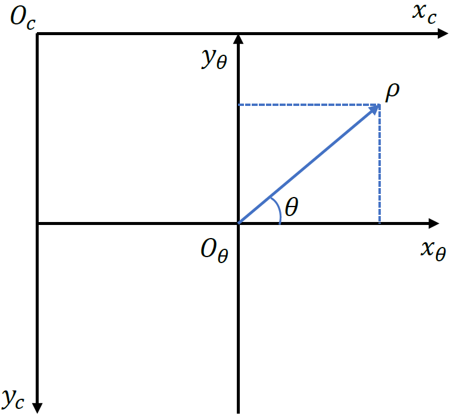

**算法步骤：**

1.  对图片进行Canny边缘提取，得到边缘图imgEdge

2.  对霍夫图像houghImg进行投票。houghImg的横坐标是rho，其取值范围是[0, 图片对角线长度的一半]；纵坐标是theta，其取值范围是[0, 360]，注意rho和theta都是整数。

3.  对houghImg进行非最大值抑制。使用一个windowsSize大小滑动窗口，去掉不是局部最大值的点。然后将检测到的参数对加入lines（vector容器）中，对lines按投票数进行排序。

4.  在lines中，要求前4条直线两两近似垂直或平行，否则从后面替换

5.  画出直线、角点和相关的点

**2、总结硬币圆检测算法的步骤**

**分析：**在平面上要确定一个圆，必须确定它的圆心(a, b)以及它的半径r。因此在做圆的检测时，若直接对其进行霍夫圆变换的话，有a, b, r三个参数，将会产生一个三维的霍夫空间！这样计算量会非常大，在实际中并不太可行。

一个不错的检测方法（网上叫**霍夫梯度法**，也叫2-1霍夫变换），是利用圆周上的点的梯度信息，而图像中每点梯度信息在前面做canny处理的时候已经计算出来了，做圆检测的时候直接拿过来用就行了。沿着圆周上的点的梯度方向做直线，这些直线的交点就是圆心（如下图所示）。霍夫梯度法的第一步是找到圆心，第二步是确定各圆心的半径，根据边缘点对某半径r的支持程度来确定半径。霍夫梯度法实现了降维，大大减少了计算量。

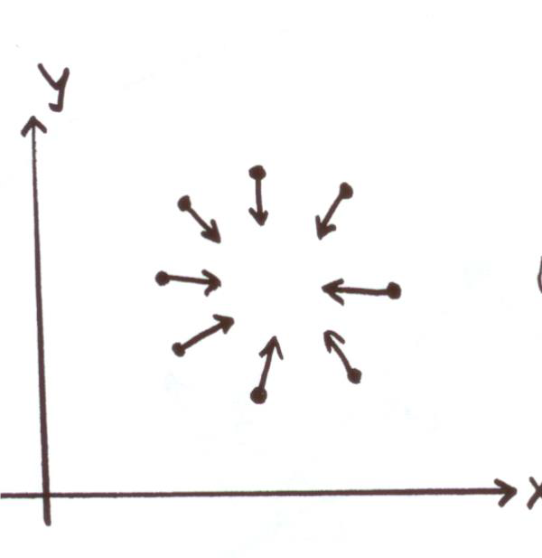

**算法步骤：**

第一阶段：确定圆心

1.  对输入图像进行Canny边缘提取，得到边缘图imgEdge。

2.  在二维的霍夫空间houghImg中，对于imgEdge每个边缘点，根据Canny计算过程中得到的delta_x（x方向上的梯度）和delta_y（y方向上的梯度）计算边缘点的梯度方向，并沿着此方向画出一条直线。在houghImg中某坐标点上的累加值越大，说明在该点上的直线相交次数越多（投票），即该点越有可能是圆心。

3.  对houghImg进行非最大值抑制。使用一个windowsSize大小滑动窗口，去掉不是局部最大值的点。

4.  设最大投票数为houghImg.max，设置一个阈值threshold，取值范围是(0, 1)。将检测到投票数大于houghImg.max \* threshold的参数加入circles（vector容器）中，对circles按投票数进行排序。

第二阶段：确定各圆心的半径

设置硬币最小最大半径，对circles中的每个圆心，在最大半径范围内的边缘点计算距离r，对r进行投票。有最大投票数的半径即为该圆心的半径。

**3、思考如何在保证精度的结果情况下加快运行速度**

**分析：**在实现过程中，某些步骤常常会占用较多的时间，在这些步骤中，最占用时间的是对全幅图片进行for循环。经过实际实验对比，得出以下能大大加快运行速度的方法：

**改进方法**：

1.  减少sin, cos, sqrt等计算。例如，在直线检测中，theta的取值是[0, 360]中的整数，并且它们的sin, cos值常常会用到，因此可以在一开始计算好这些值并存到vector容器（sin的容器和cos的容器各有360+1个元素）中。后面要用到这些值时，直接用vector容器中读取就行了，不必每次都计算sin,cos。这样改进后，运行速度加快不少。

2.  减少对全幅图片的像素进行for循环。例如，在圆检测中，对圆心投票时要在每个像素点上按梯度方向画一条直线，不必对全幅图片的像素进行for循环。有效的做法是，设置一个硬币最大半径（一般设置为maxRadius
    = width \< height ? width / 2 : height / 2），按照当前像素点的梯度方向，画一条2\*maxRadius的直线，从r = -maxRadius开始到r = maxRadius，每次r加一，根据r和梯度方向就可以计算直线点的坐标(x, y)，从而就可以对点(x, y)进行投票。由本次实验的实际操作得知，这样改进后的运行速度大大加快。

3.  减少for循环的嵌套层数，改进算法。
